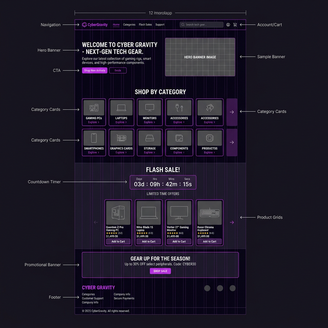
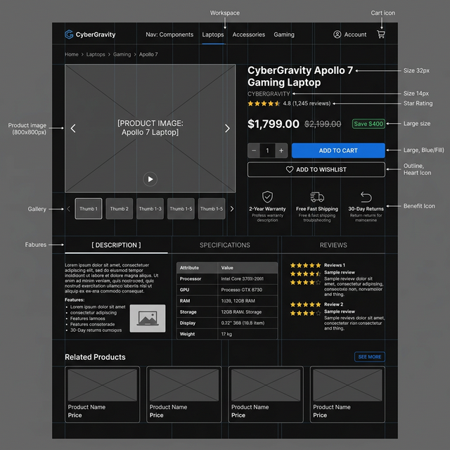
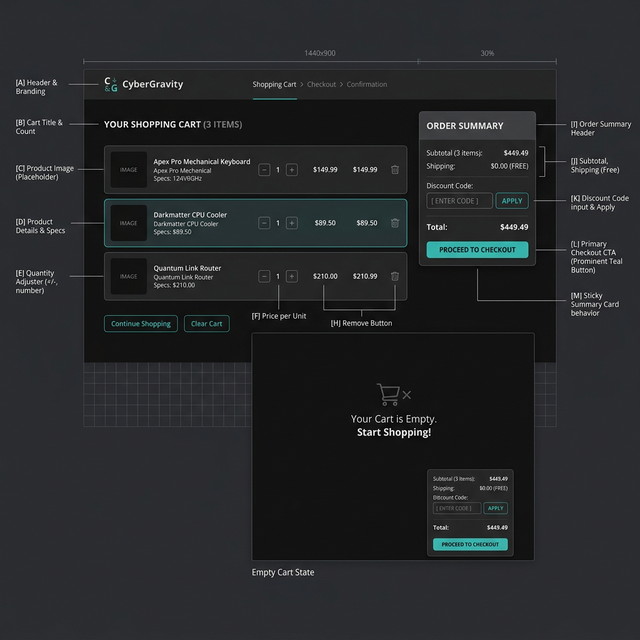
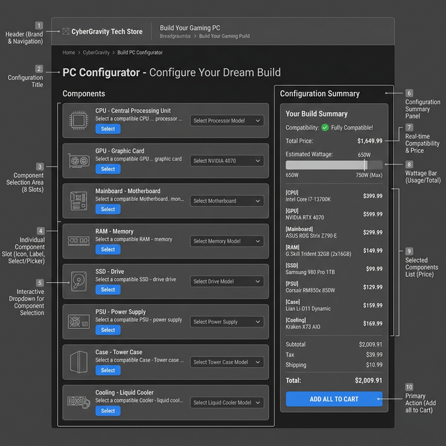
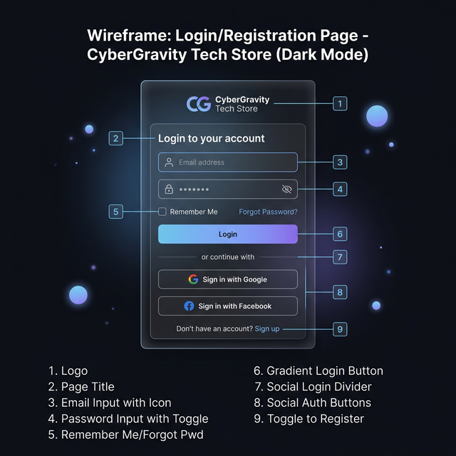

# CyberGravity — Wireframes

Tài liệu wireframe cho các trang chính của website CyberGravity.

## Danh sách Wireframes

### 1. Trang chủ (Homepage)

**Mô tả:** Hero banner, danh mục sản phẩm (8 categories), Flash Sale với countdown, sản phẩm nổi bật, banner Build PC, footer.

---

### 2. Danh sách sản phẩm (Product Listing)

**Mô tả:** Sidebar bộ lọc (danh mục, khoảng giá, thương hiệu, đánh giá), lưới sản phẩm 3 cột, sắp xếp, phân trang, breadcrumb.

---

### 3. Chi tiết sản phẩm (Product Detail)

**Mô tả:** Gallery ảnh sản phẩm, thông tin giá/giảm giá, đánh giá sao, chọn số lượng, nút mua hàng, tabs (mô tả, thông số, đánh giá), sản phẩm liên quan.

---

### 4. Giỏ hàng (Cart)

**Mô tả:** Danh sách sản phẩm trong giỏ, điều chỉnh số lượng, tóm tắt đơn hàng, mã giảm giá, nút thanh toán. Trạng thái giỏ trống.

---

### 5. Build PC (Cấu hình máy tính)

**Mô tả:** 8 slot linh kiện (CPU, GPU, Mainboard, RAM, SSD, PSU, Case, Tản nhiệt), dropdown chọn sản phẩm, bảng tóm tắt cấu hình, kiểm tra tương thích, thanh công suất.

---

### 6. Đăng nhập / Đăng ký (Auth)

**Mô tả:** Form glassmorphism với logo, email/password inputs, toggle hiện mật khẩu, nút đăng nhập/đăng ký gradient, social login (Google, Facebook), chuyển đổi login/register.

---

## Quy ước thiết kế

| Yếu tố | Mô tả |
|---------|-------|
| **Theme** | Dark mode (#0a0a0f background) |
| **Accent** | Purple gradient (#8b5cf6 → #06b6d4) |
| **Cards** | Glassmorphism (backdrop-blur, border white/10) |
| **Buttons** | Gradient primary, ghost secondary |
| **Typography** | Outfit (headings), Inter (body) |
| **Animations** | Framer Motion hover/enter effects |
